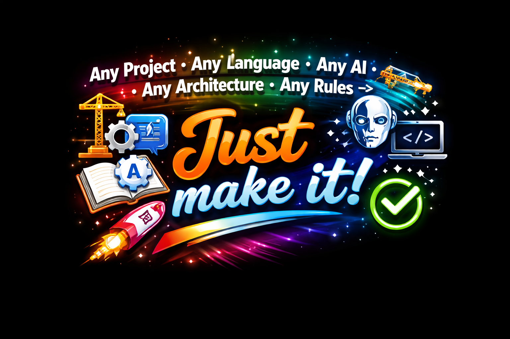

# AISpec — AI Feature Development Assistant

<p align="center">
  
</p>

---

<p align="center">
  <strong>Stop prompting. Start shipping.</strong><br/>
  Generate structured, production-ready plans that ANY AI agent follows perfectly.
</p>

<p align="center">
  <a href="https://marketplace.visualstudio.com/items?itemName=PonsMauro.aispec">
    
  </a>
  
  
</p>

---

## One Sentence

AISpec generates a complete development workflow including git setup, project scanning, architecture analysis, and a 7-step implementation plan — agnostic to any AI, language, framework, and architecture.

---

## Why AISpec?

| Without AISpec | With AISpec |
|----------------|-------------|
| ❌ AI forgets your project rules | ✅ Rules in EVERY step |
| ❌ AI skips quality checks | ✅ Mandatory checks (REUSE, SECURITY, PERFORMANCE) |
| ❌ AI adds features you didn't ask for | ✅ Strict scope enforcement |
| ❌ Multiple iterations = wasted tokens | ✅ First-attempt accuracy |
| ❌ "Just make it work" = technical debt | ✅ Architecture enforced |

**Result: 60-70% reduction in AI token costs per feature.**

---

## What does it do?

AISpec generates a complete 7-step development plan that forces AI to:

1. **Confirm your input** (you approve first)
2. **Show project rules** (from CLAUDE.md, .cursorrules, linters, etc.)
3. **Create prompt-init.md** (rules file)
4. **Scan project** → Create context.md (architecture, patterns, tech debt)
5. **Generate plan.md** (step-by-step with checks)
6. **Implement** (with validation at each step)
7. **Finalize** (docs, tests, PR ready)

---

## ⚡ Optimized for AI-Assisted Development

<blockquote style="margin: 24px 32px; text-align: center; padding: 16px;">
  <strong>⚠️ HIGHLY RECOMMENDED ⚠️</strong><br/><br/>
  Always run this prompt in <strong>PLAN MODE</strong> in your AI tool.<br/>
  This ensures the AI focuses on analysis and planning before writing any code, preventing costly mistakes.
</blockquote>

---

## What you get

When you click **Generate & Copy**, se generará el siguiente proyecto:

```
{project}/
├── {specsFolder}/
│   └── {featureName}/
│       ├── prompt-init.md    # Initial setup, rules, reference docs
│       ├── context.md        # Project snapshot, AI configs, architecture
│       └── plan.md           # 7-step workflow with RULES + CHECKS + ARCHITECTURE
```

---

## Features

- ✅ **Works with ANY AI** — Claude, GPT, Cursor, Windsurf, Copilot...
- ✅ **Auto-detects rules** — CLAUDE.md, .cursorrules, .windsurfrules, AGENTS.md
- ✅ **7-step workflow** — With PLAN MODE and human approval
- ✅ **Rules in every step** — No more forgotten rules
- ✅ **Mandatory checks** — REUSE, ARCHITECTURE, PERFORMANCE, SECURITY
- ✅ **Greenfield & Brownfield** — New projects or existing code
- ✅ **Dark/Light theme** — Respects your VS Code
- ✅ **One-click copy** — Generates and copies to clipboard

---

## Universal Compatibility

AISpec is completely agnostic — it doesn't care what you use:

| Category | Works With |
|----------|------------|
| **AI Agents** | Claude, GPT-4, Gemini, Cursor, Windsurf, Copilot, Codeium, any LLM |
| **Languages** | Python, JavaScript, TypeScript, Go, Rust, Java, C#, Ruby, PHP, any |
| **Frameworks** | React, Vue, Angular, Django, FastAPI, Rails, Laravel, Spring, any |
| **Architectures** | Hexagonal, Clean, Layered, Microservices, Serverless, any |
| **Project Types** | New projects, legacy code, greenfield, brownfield |

---

## Perfect For

| Use Case | Why AISpec? |
|----------|-------------|
| **All AI Users** | Save 60-70% tokens by getting it right the first time |
| **Vibe Coding** | Structure prevents AI from going off-track |
| **Multiple AIs** | Same results with Claude, GPT, Cursor... |
| **Team Projects** | Everyone follows the same rules |
| **Legacy Code** | Discovers and respects existing patterns |
| **Quality Focus** | Mandatory checks prevent mistakes |
| **AI Beginners** | Learn best practices with guided structure |
| **Cost Conscious** | Less iterations = less token costs |

---

## Quick Start

1. Open VS Code → Click **AISpec** in the sidebar
2. Fill the form (project, feature name, descriptions)
3. Click **Generate & Copy**
4. Paste into any AI assistant
5. Watch it follow YOUR rules

---

## Requirements

- VS Code 1.85.0+
- Git (optional, for branch/worktree features)
- Any AI assistant — Claude, GPT, Cursor, Windsurf, etc.

---

## Installation

### VS Code Marketplace (Recommended)
1. Open VS Code → Extensions (`Cmd/Ctrl + Shift + X`)
2. Search for **"AISpec"**
3. Click **Install**

### Manual (VSIX)
```bash
code --install-extension aispec-0.0.19.vsix
```

### Don't see the plugin?
1. Reload VS Code window: `Cmd/Ctrl + Shift + P` → "Reload Window"
2. Check if extension is enabled: `Extensions` → `AISpec` → Enable
3. If still not working, check VS Code version (requires 1.85.0+)

---

<p align="center">
  <strong>Stop debugging AI mistakes. Start shipping.</strong><br/>
  <em>AISpec — Structure your AI development.</em>
</p>
