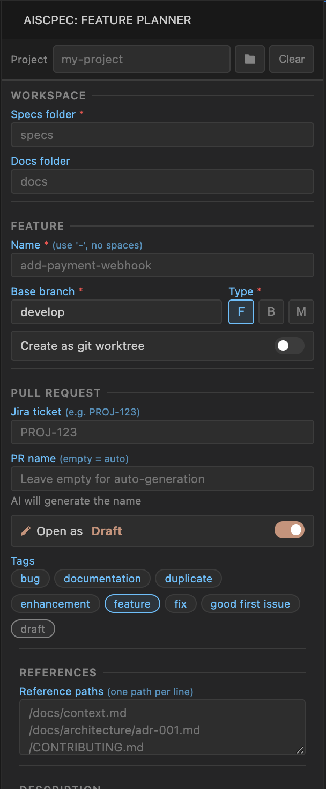

# AISpec - AI Feature Development Assistant

Generate comprehensive AI prompts for feature development directly from VS Code.

## What is AISpec?

AISpec helps developers create well-structured, comprehensive prompts for AI-assisted feature development. Fill in a simple form, and get a complete development prompt that follows best practices.

## Features

- **Easy Form Input** - Capture feature requirements without writing prompts manually
- **AI-Ready Prompts** - Generate complete prompts following development best practices
- **Best Practices Included** - SOLID, YAGNI, DRY, KISS principles embedded
- **Security First** - Built-in security checklist and secrets protection guidelines
- **Error Handling** - Resilience patterns, logging best practices, retry logic
- **Incremental Development** - Plans structured from simple to complex tasks
- **100% Coverage Goal** - Test coverage guidelines included

## Quick Start

1. Open VS Code Command Palette (`Cmd/Ctrl + Shift + P`)
2. Find and open "AISpec"
3. Fill in the feature details
4. Click "Generate Prompt"
5. Copy and paste into your AI assistant

## What You Get

The generated prompt includes:

- Project context analysis
- Structured implementation plan (simple → complex)
- Technical principles (SOLID, DRY, KISS)
- Security checklist
- Error handling guidelines
- Quality assurance steps
- PR preparation instructions

## Perfect For

- Developers working with AI assistants (Claude, GPT, etc.)
- Teams wanting consistent feature development
- Projects requiring well-documented features
- Anyone tired of writing prompts manually

## Requirements

### Required
- VS Code 1.85.0 or higher
- A project open in VS Code
- Git installed (for worktree and branch features)

### Recommended MCPs/Skills
For the best experience, configure these MCPs (Model Context Protocol):

- **Issue Tracker MCP** - Connect to Jira, GitHub Issues, Linear, etc.
- **Git/GitHub MCP** - Create branches, PRs, check repository status
- **AI Assistant** - Your preferred AI model (Claude, GPT, etc.)
- **File System MCP** - Read/write documentation files

### Optional
- Configured linters and formatters
- Test suite set up
- CI/CD pipeline configured

## Installation

Install from VS Code Marketplace or search "AISpec" in the Extensions panel.

---

**Made for developers who embrace AI-assisted development**
